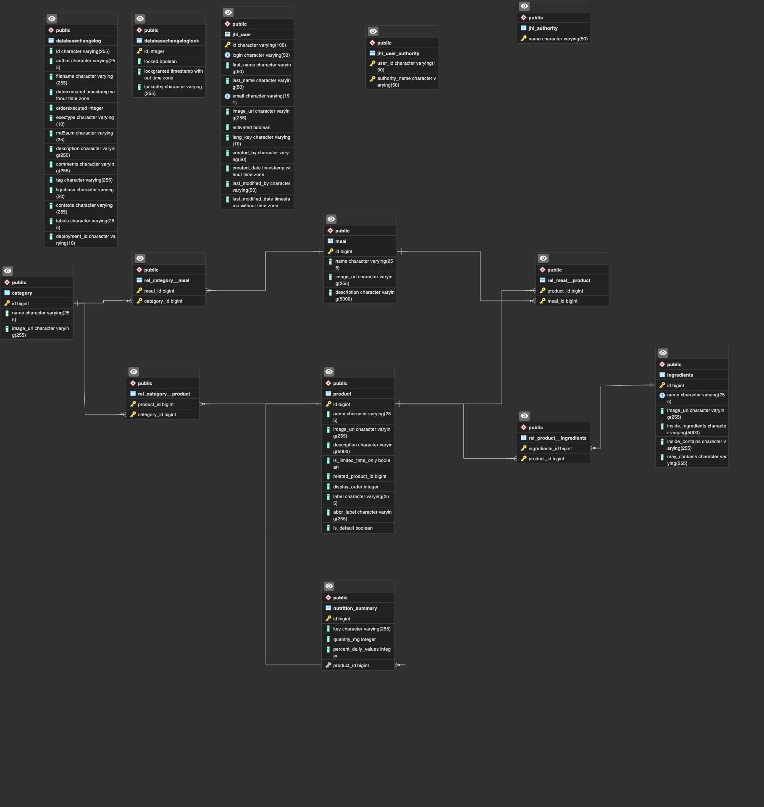
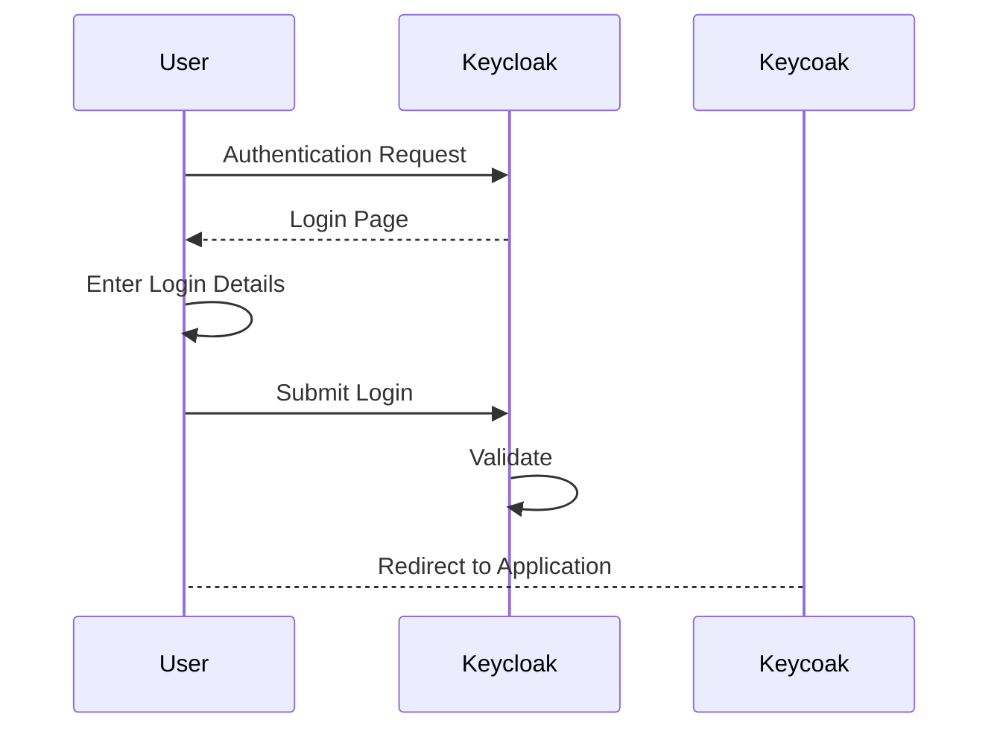
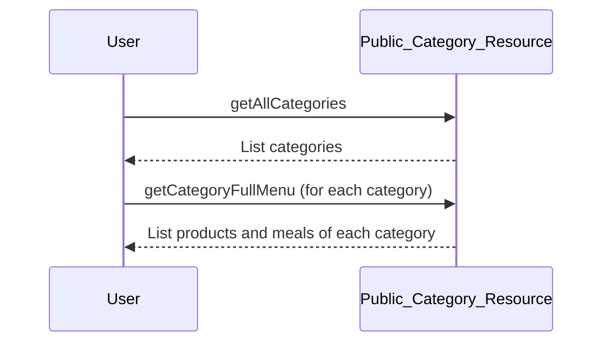
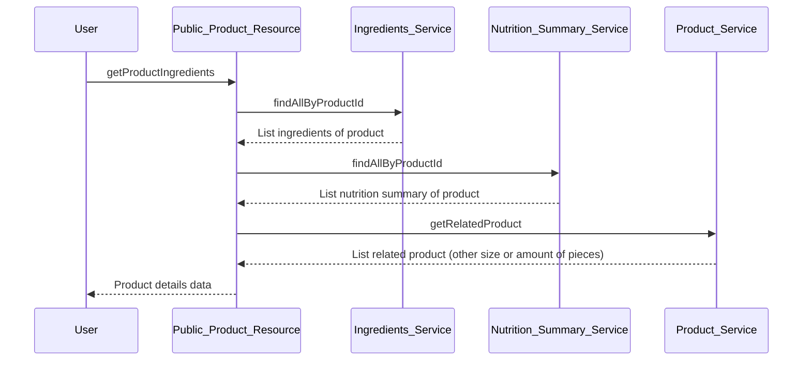

# McMenu

This application was generated using JHipster 7.9.3

## Database schema

## Sequence Diagram

1. Login

2. Load full menu

3. Product details

## Technologie

- Framework: Jhipster
- Database: PostgreSQL
- Deployment: Heroku
