# McMenu

This application was generated using JHipster 7.9.3.

## Link project

[Link](https://mc-menu.herokuapp.com)

## How to start project

```shell
npm install # install packages
npm run java:docker:arm64 # make sure using java 11
docker-compose -f src/main/docker/app.yml up -d # start docker
```

If you want init data, please use this data [Database script](./docs/backup_mcmenu.sql).

## Database schema


## Sequence Diagram

- Login

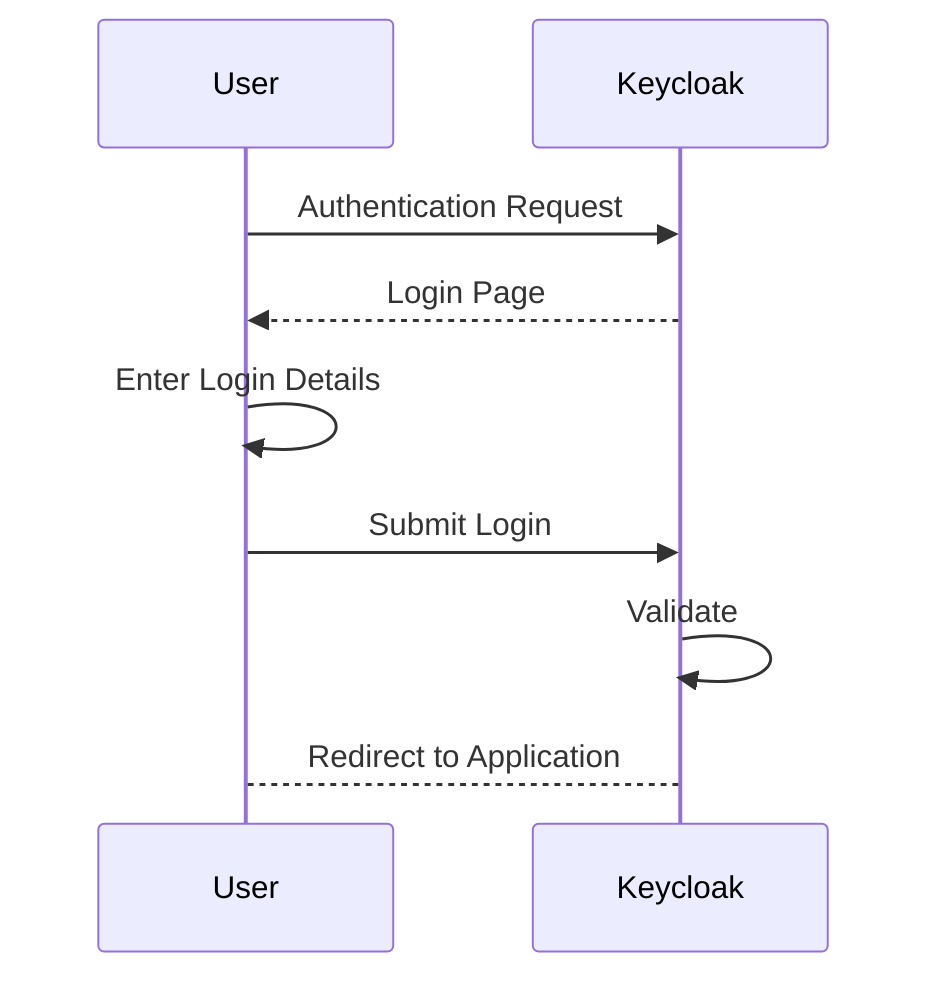

- Register

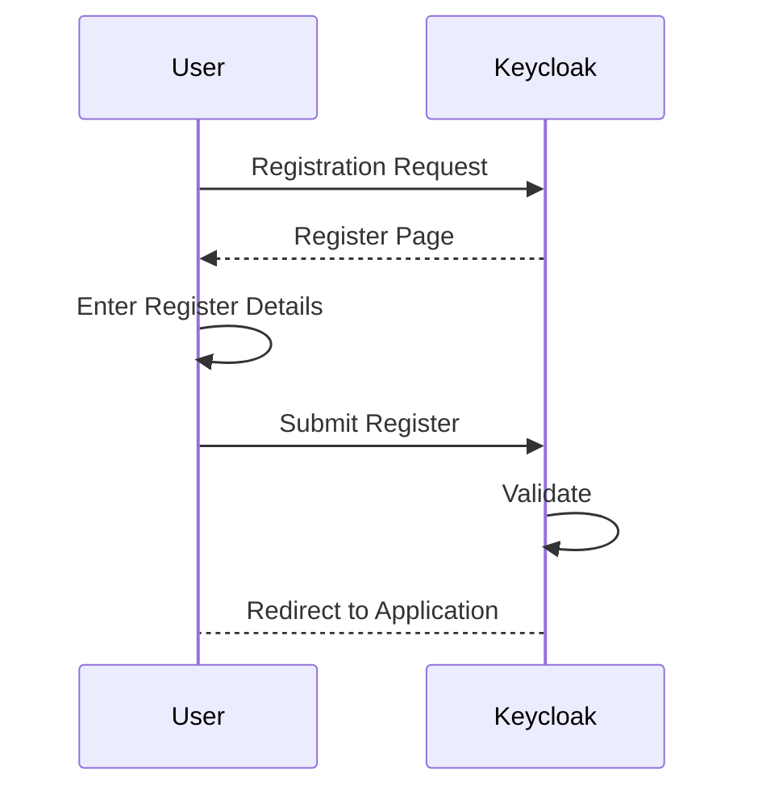

- Logout

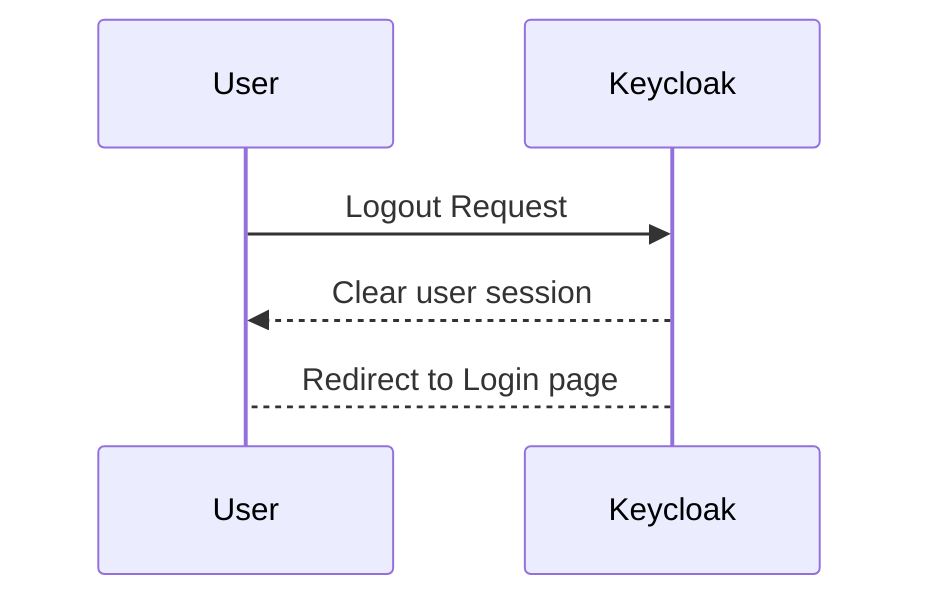

- Create menu (only admin)

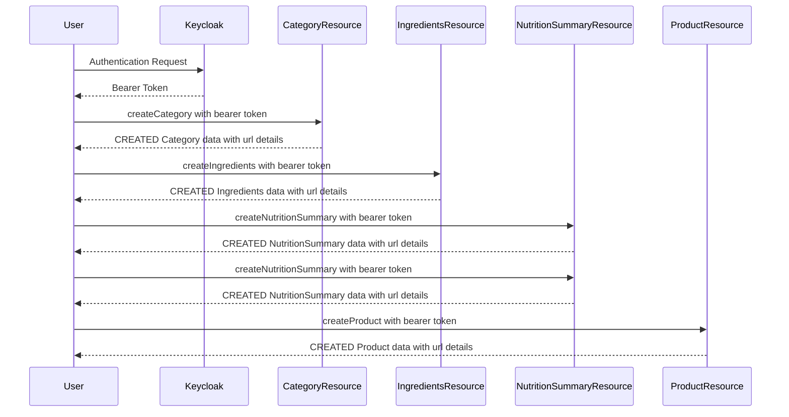

- Load full menu

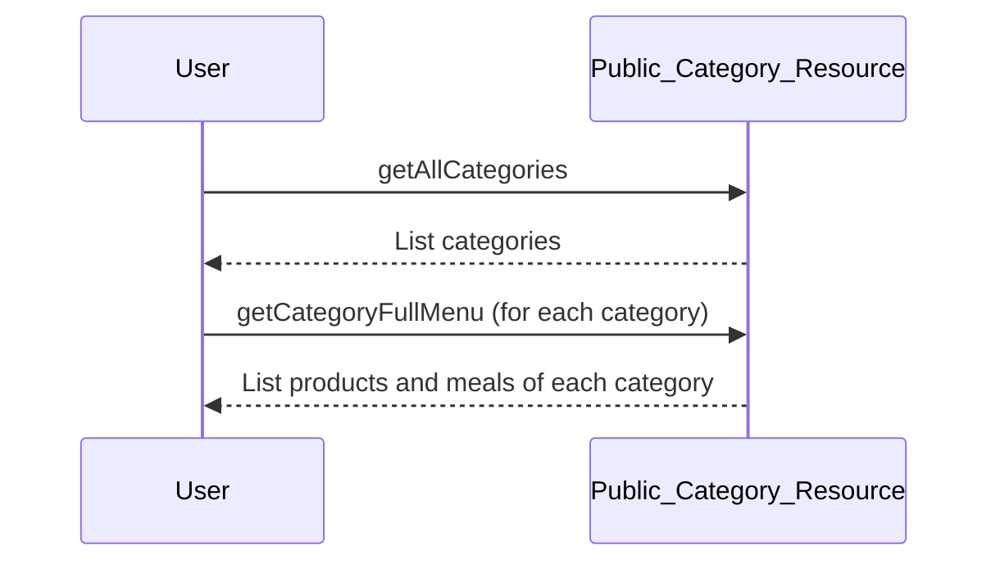

- Product details

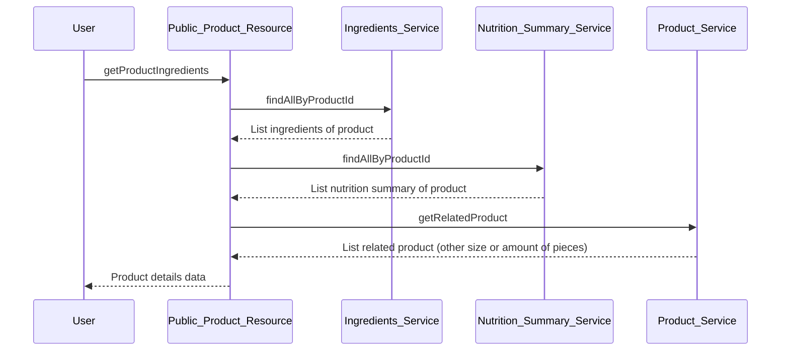

- Create category (only admin)

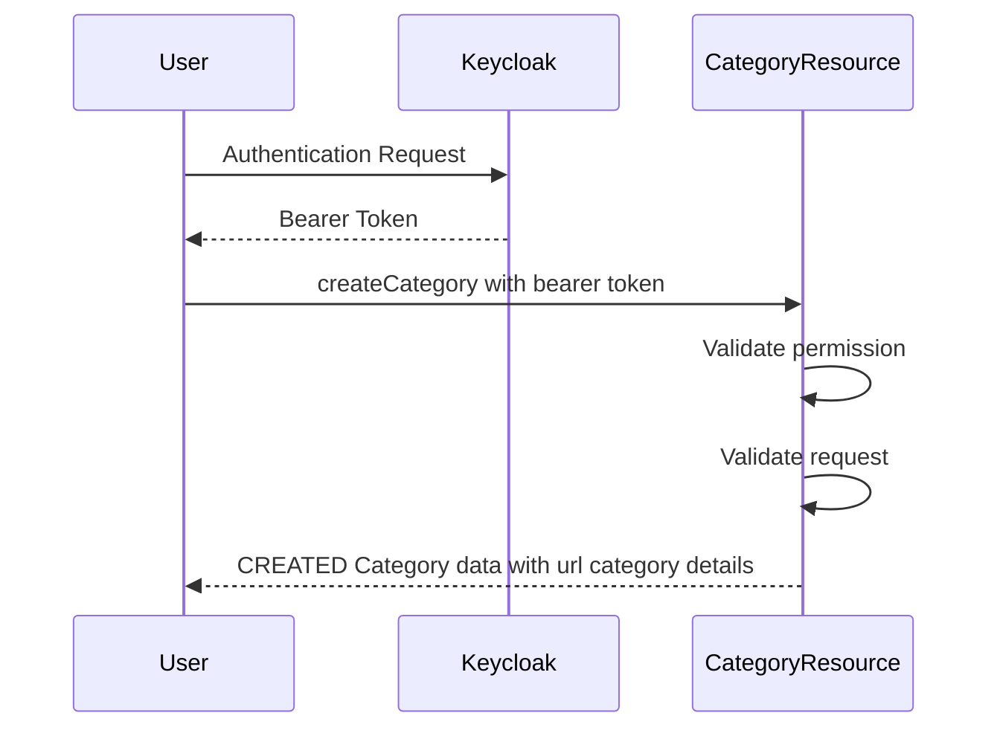

- Update category (only admin)

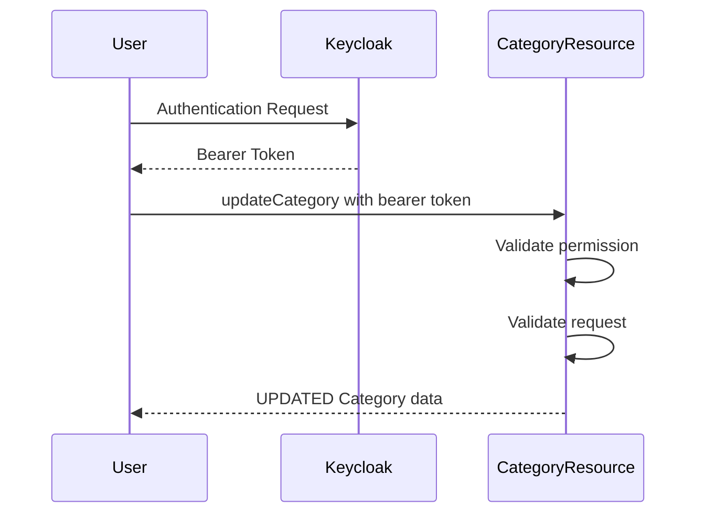

- Update partial category (only admin)

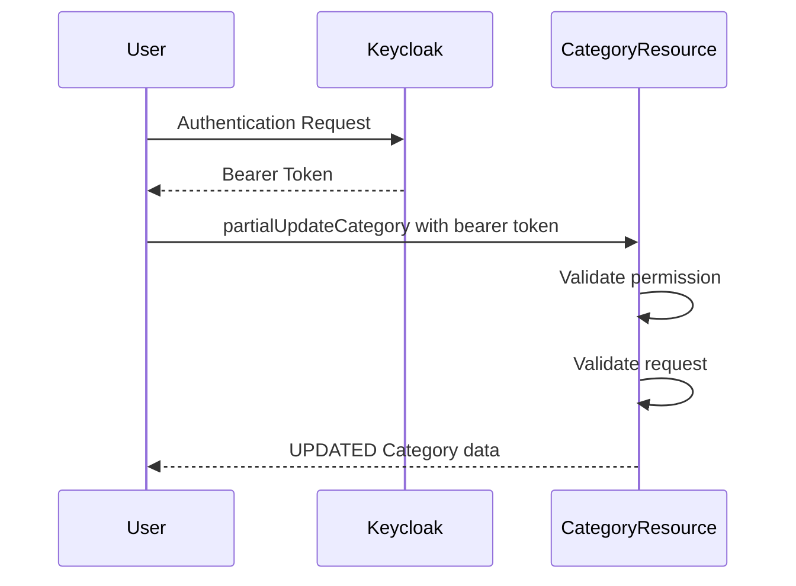

- List category (only admin)


- Category detail (only admin)

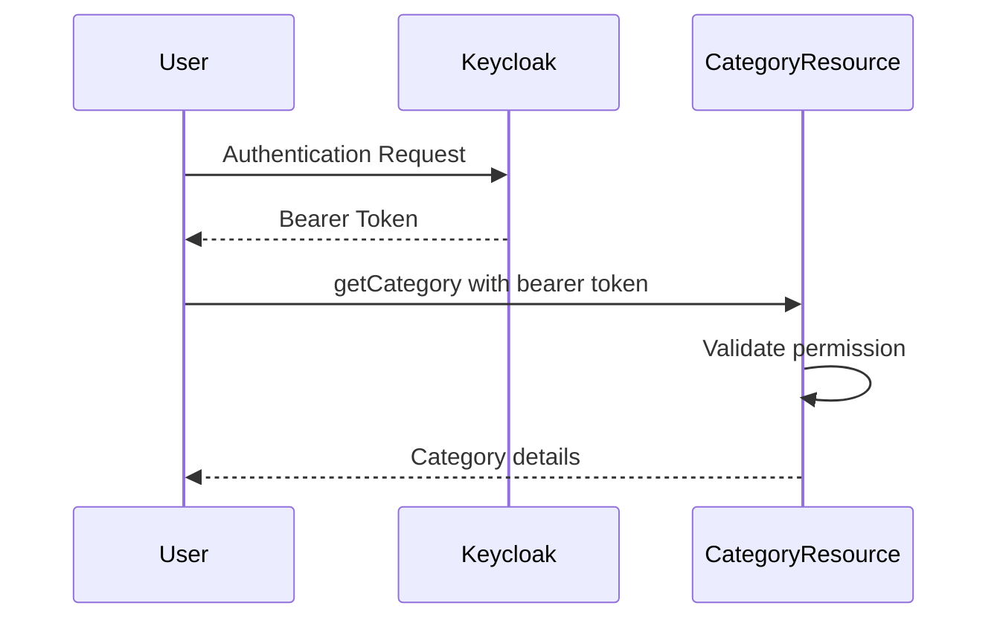

- Delete category (only admin)

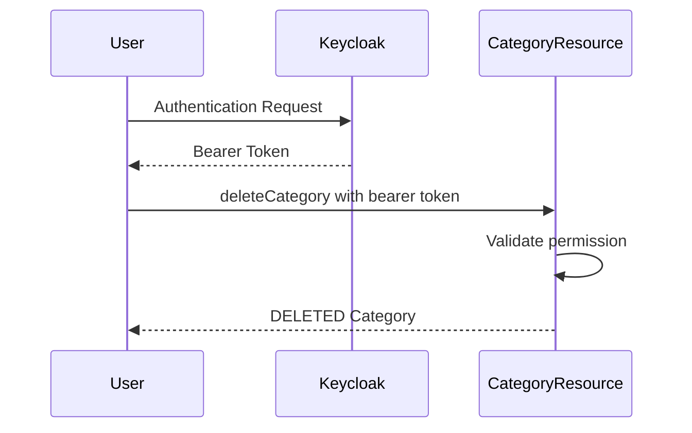

- Search category (only admin)

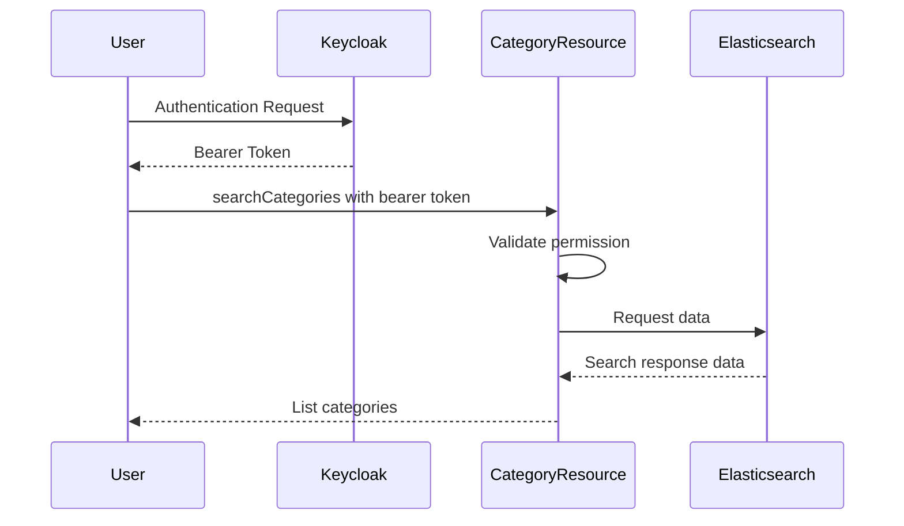

- ... The same for other APIs ...

## Technologie

- Framework: Jhipster
- Database: PostgreSQL
- Deployment: Heroku
